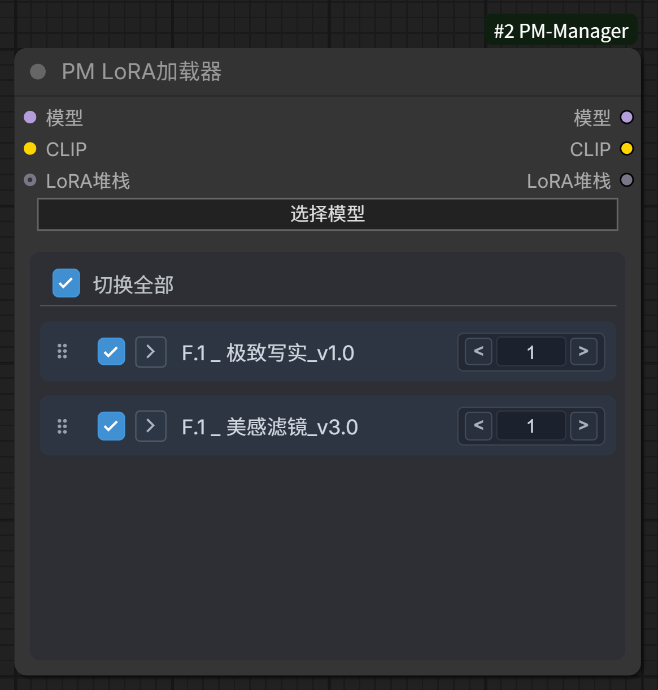
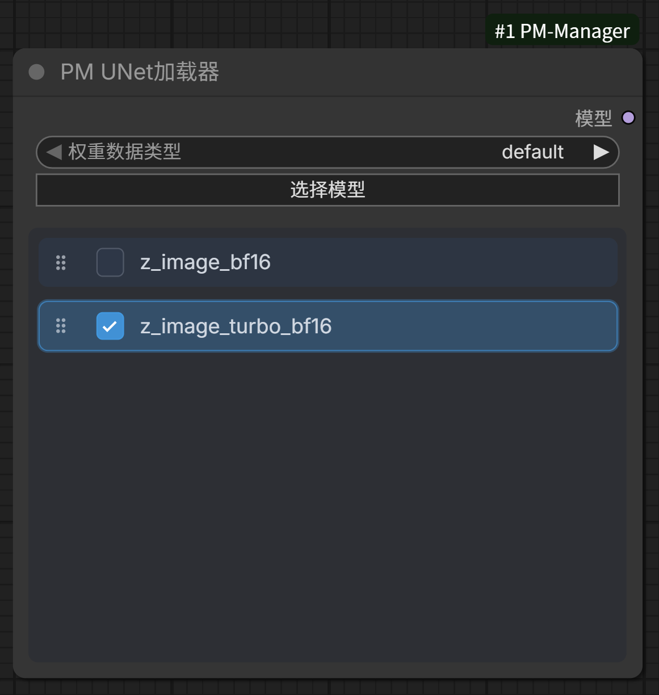
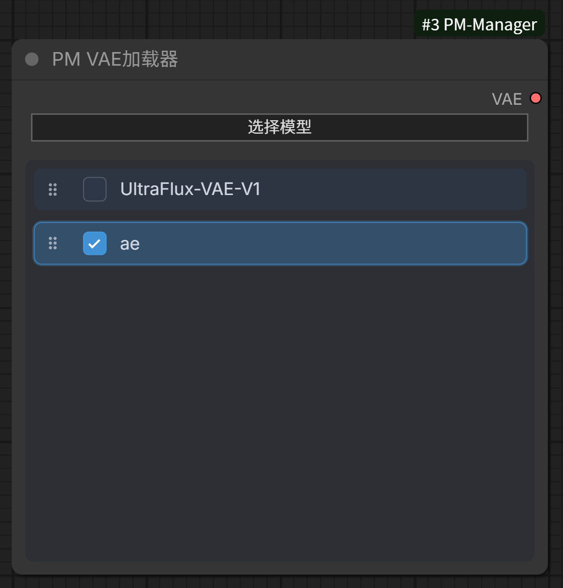
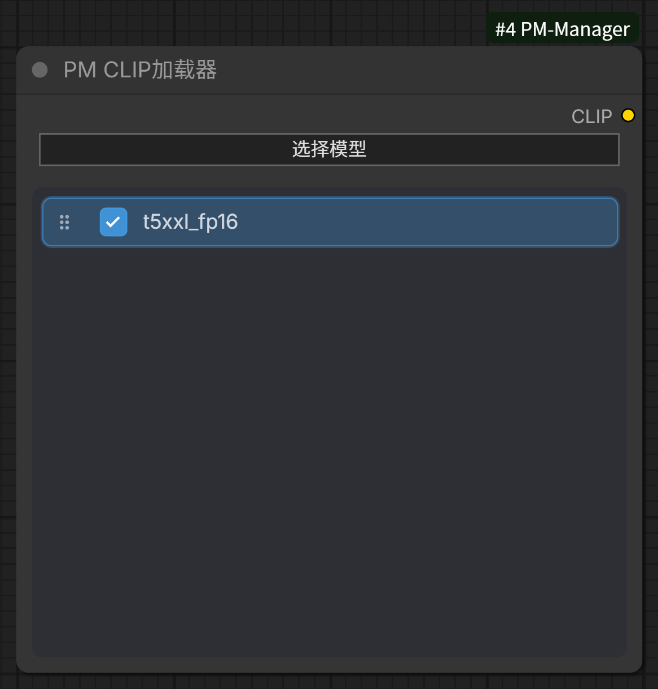
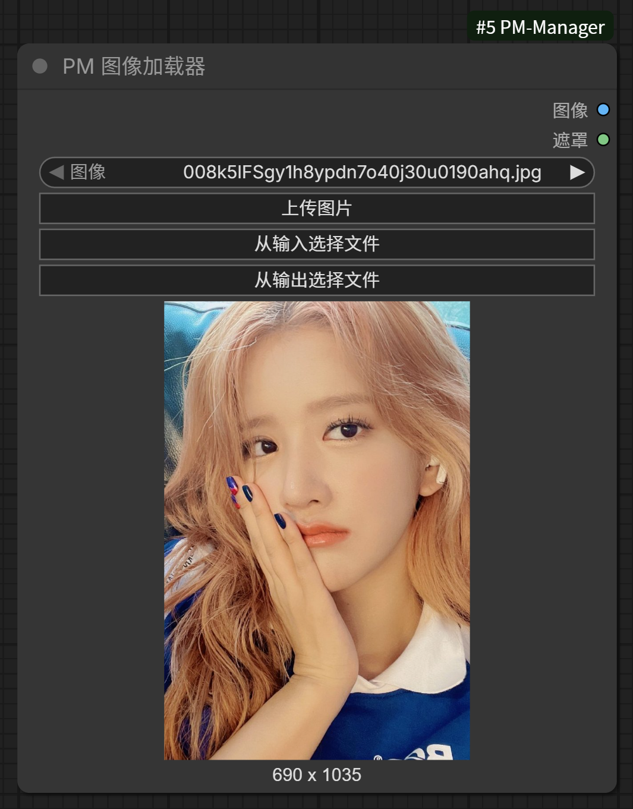
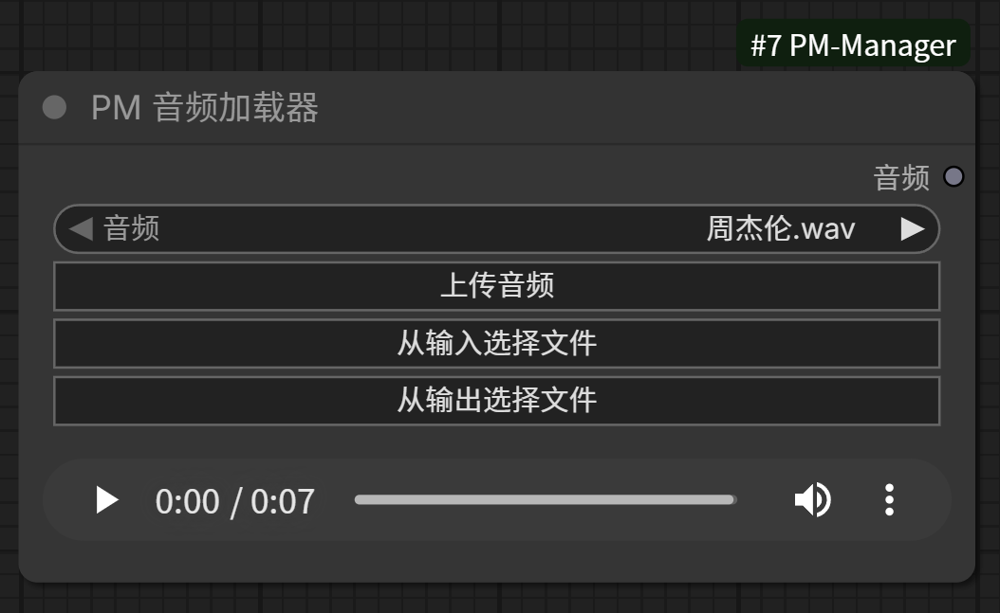
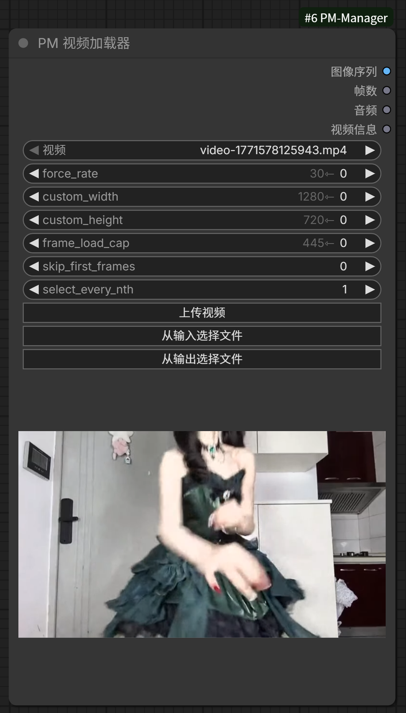

# ComfyUI-PM-Manager

一个功能强大的ComfyUI扩展，提供增强的模型管理、媒体加载和工作流管理功能。

## 功能特性

### 核心功能

- **增强的模型加载器**：提供UNet、VAE、CLIP和LoRA的高级加载器
- **媒体加载器**：支持图像、音频和视频的加载
- **工作流管理**：完整的工作流保存、加载、预览和管理功能
- **模型管理**：模型的组织、预览、元数据编辑功能
- **输入/输出管理**：媒体文件的上传、预览和管理

### 增强节点

#### PM LoRA Loader
- 支持多个LoRA的堆叠管理
- 可独立调整每个LoRA的模型强度和CLIP强度
- 拖拽排序功能
- 预览工具提示
- 激活/停用切换
- 上下文菜单支持

#### PM UNet Loader / PM VAE Loader / PM Clip Loader
- 增强的模型选择界面
- 预览功能
- 组织管理

#### PM Image Loader / PM Audio Loader / PM Video Loader
- 增强的媒体选择和预览
- 支持多种格式

## 安装

### 方法1：使用ComfyUI Manager（推荐）
1. 打开ComfyUI
2. 进入ComfyUI Manager
3. 搜索"ComfyUI-PM-Manager"
4. 点击安装

### 方法2：手动安装
1. 克隆或下载此仓库到ComfyUI的`custom_nodes`目录：
   ```bash
   cd ComfyUI/custom_nodes
   git clone https://github.com/pixel-magician/ComfyUI-PM-Manager.git
   ```
2. 重启ComfyUI

## 使用指南

### PM LoRA Loader 使用

1. 在节点菜单中搜索"PM LoRA Loader"并添加到工作流
2. 连接model和clip输入
3. 点击"选择模型"按钮打开LoRA管理器
4. 在管理器中选择要添加的LoRA模型
5. 调整每个LoRA的模型强度和CLIP强度
6. 可以通过拖拽重新排序LoRA
7. 使用切换按钮激活/停用特定LoRA
8. 右键点击LoRA项可查看详情、上移、下移或删除

### PM UNet/VAE/CLIP Loader 使用

1. 在节点菜单中搜索对应的加载器节点
2. 点击"选择模型"按钮打开模型管理器
3. 浏览并选择需要的模型
4. 支持模型预览和文件夹组织

### PM Image/Audio/Video Loader 使用

1. 在节点菜单中搜索对应的媒体加载器
2. 点击"上传"按钮上传本地文件，或点击"从输入/输出选择"选择已有文件
3. 支持媒体预览功能

### 工作流管理

- 保存工作流：使用工作流管理界面保存当前工作流
- 加载工作流：浏览并加载已保存的工作流
- 预览工作流：查看工作流的预览图
- 组织管理：创建文件夹组织工作流

### 模型管理

- 预览模型：查看模型预览图
- 编辑元数据：为模型添加描述和标签
- 组织管理：创建文件夹组织模型

## 截图展示

### PM LoRA Loader
支持多LoRA堆叠管理，可独立调整每个LoRA的模型强度和CLIP强度，支持拖拽排序和激活/停用切换。



### PM UNet Loader
增强的UNet模型选择界面，支持模型预览和组织管理。



### PM VAE Loader
增强的VAE模型选择界面，支持模型预览。



### PM CLIP Loader
增强的CLIP模型选择界面，支持模型预览。



### PM Image Loader
增强的图像加载器，支持图像预览和管理。



### PM Audio Loader
增强的音频加载器，支持音频预览。



### PM Video Loader
增强的视频加载器，支持视频预览。


